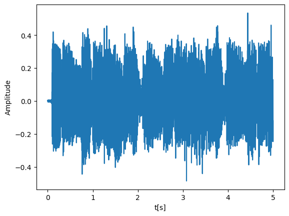
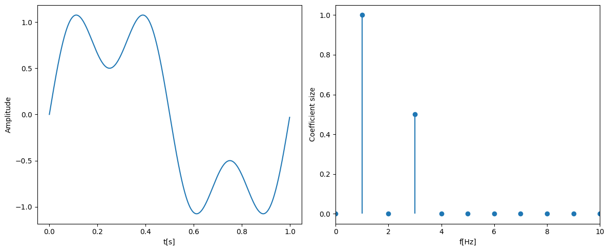
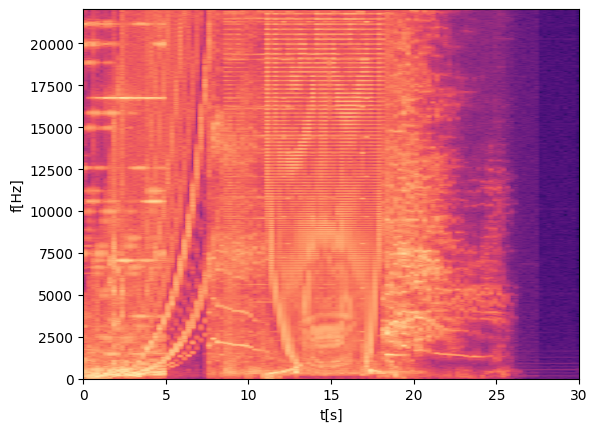

# Song Recognition Algorithm
## 1. Introduction
Approximately two months ago I stumbled onto [this](https://www.youtube.com/watch?v=a0CVCcb0RJM) youtube video about recreating Shazam. After watching the video I was quite surprised by the apparent simplicity of the algorithm. Of course I realized this is a very broad overview of what the algorithm does. So after looking at the comments I found a comment from Ron Van Rijn from whom the original video creator had taken some inspiration. I have then found a [blog](https://www.royvanrijn.com/blog/2010/06/creating-shazam-in-java/) and a [youtube video](https://www.youtube.com/watch?v=T4PJoAh4X1g) from the commenter which have then served as the main source for this project.   
## 2. Data
Before starting to work on the actual algorithm the problem of where to find a sufficient amount of songs had to be solved. A convenient way to download them was via youtube using a library called `yt_dl`. Still a list of songs to download was required. For this I the inspiration was taken from the main source where the Rolling Stone Top 500 Songs was used. To use this in the program I found a [repository](https://gist.githubusercontent.com/keune/0de5c7fb669f7b682874/raw/4aabd7282ee6b58ff886af50489cbcc6c4bd1faf/RollingStone%2520Top%2520500%2520Song) containing a json file with the list. For this to be done efficiently I used multiprocessing so that multiple songs can get downloaded at once and stored in an sqlite database. 
## 3. Algorithm
### 3.1 Sound
To understand the algorithm we have to first understand that sound is a waveform which gets stored digitally by sampling its amplitude at a chosen sampling rate such as $44.1\text{kHz}$. When we read the data into a program in python we usually get a one dimensional numpy array:

<pre>
[0.00101867 0.00158976 0.00167912 ... 0.00011148 0.00012591 0.00010241]
</pre>

Each element of this array presents an amplitude of the waveform at a point in time. So if we have a recording of length $1\text{s}$ at $44.1\text{kHz}$ sampling rate this array would be of length $44100$. We can also visualize this signal on a plot of amplitude to relation to time: 

  

### 3.2 Fourier Transform and Spectrograms
The underlying idea of Fourier Transform is that all sound waveforms are a sum of sine waves:

\[
s(t) = \sum_{n} C_n \sin\big(2\pi f_n t + \phi_n\big)
\]

With Fourier Transform we can then extract the frequencies $f_n$ and their respective coefficients $C_n$. For example if we take a signal $s(t) = \sin(2\pi t) + 0.5\sin(2\pi 3 t)$ this is the output of the Discrete Fourier Transform:

  

Our signal is not changing frequencies through time which is not true in sound. So an interesting thing to draw is a spectrogram which shows how magnitudes of different frequencies changes through time. To do this the signal gets split into an overlapping windows. For example if we have a $2\text{s}$ signal and $1\text{s}$ windows we can use the following intervals $0$-$1\text{s}$, $0.5$-$1.5\text{s}$, $1$-$2\text{s}$. An interesting example of a spectrogram is from a song Equation by Aphex Twins which has a face drawn in the last $30\text{s}$:

  

